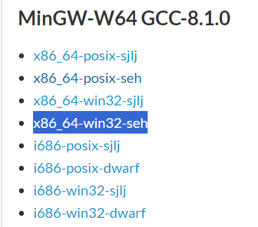
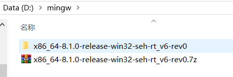
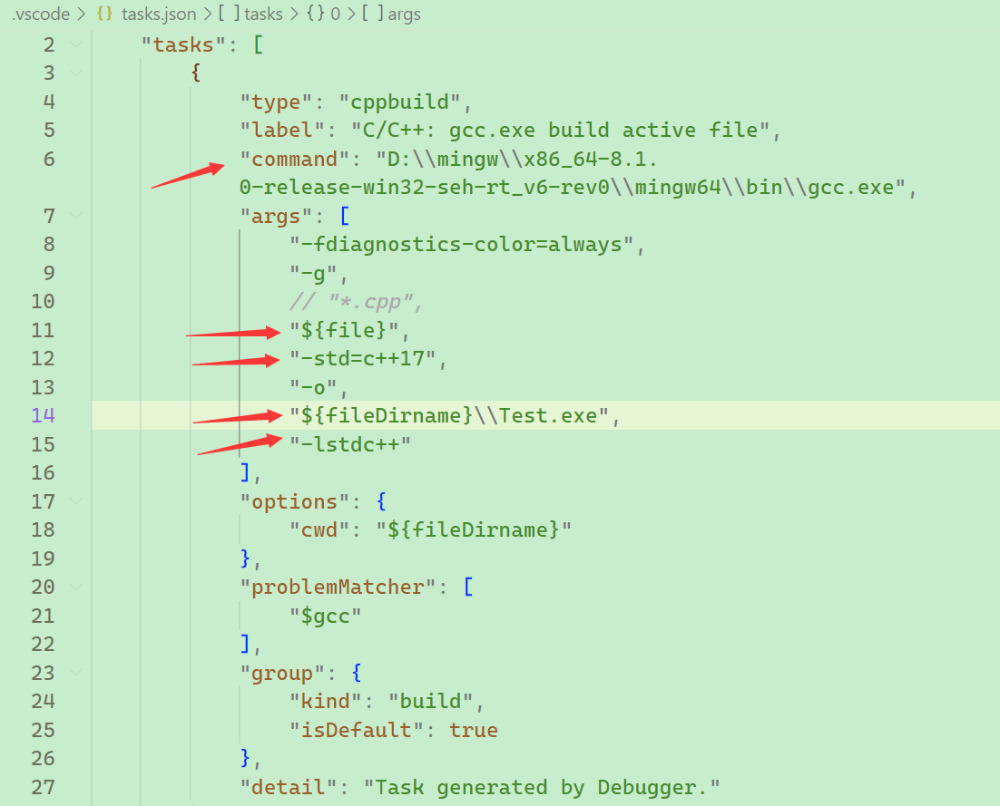
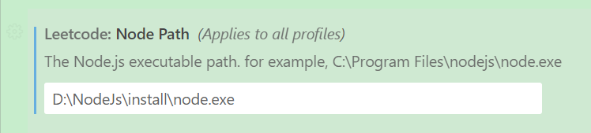

## 下载mingw

[MinGW-w64 - for 32 and 64 bit Windows - Browse /mingw-w64/mingw-w64-release at SourceForge.net](https://sourceforge.net/projects/mingw-w64/files/mingw-w64/mingw-w64-release/)

配置环境变量。

## vscode配置调试

配置vscode task.json。

## vscode插件配置

